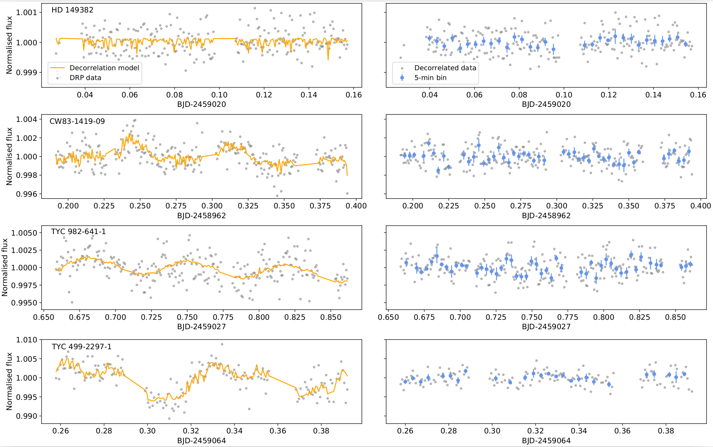

# Files Keys corresponding to the CHEOPS data presented in Fig. 5: 

HD 149382, fifth visit, file key: CH_PR100002_TG005905_V0102

CW83-1419-09, first visit, file key: CH_PR100002_TG009801_V0100

TYC982-641-1, first visit, file key: CH_PR100002_TG014801_V0100

TYC499-2297-1, fourth visit, file key: CH_PR100002_TG012604_V0100

  

_Fig 5. Representative light curves of hot subdwarfs produced by CHEOPS. From top to bottom: HD 149382 (G=8.9) in its fifth
visit, CW83 1419-09 (G=12.0) in its first visit, TYC 982-6141 (G=12.2) in its first visit, and TYC 499-2297-1 (G=12.6) in its
fourth visit. In all cases, the raw light curves as processed by the DRP (grey dots) are displayed in the left panels, jointly with the
best decorrelation model (orange line) found by means of the pycheops package. In the right panels, the decorrelated data (grey
dots) with a 5-min bin (blue dots) are shown. The y-scale is the same for each pair of right-and-left panels._
